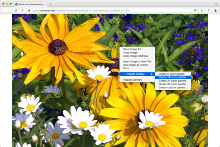
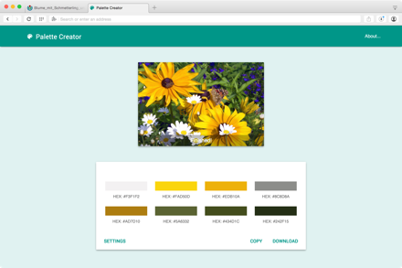

# Palette Creator   

Creates a color palette from any image. Just right-click on the image and select the *Palette Creator* option.

 

## Description

Do you want to create a color palette that matches an image from your website? Or maybe you just want to grab some colors for inspiration? Then this is the extension for you!

Just right-click on the desired image, select the *Palette Creator* option, and choose the number of colors you want the palette to have.

A new tab will open, displaying the image and the resulting color palette. It's that easy!

PS: When installing *Palette Creator*, your browser will warn you that this extension can access your data on all sites, and your browsing history. These permissions are required to load and process images from any domain. No information is stored on your computer and no personal data is obtained from this extension. I promise!

## Install

Go to the [Palette Creator home page](https://chrome.google.com/extensions/detail/oolpphfmdmjbojolagcbgdemojhcnlod) and hit the *Install* button.

## Meta

* Code: `git clone git://github.com/unindented/palette-creator.git`
* Home: <https://chrome.google.com/extensions/detail/oolpphfmdmjbojolagcbgdemojhcnlod>

## Contributors

* Daniel Perez Alvarez ([unindented@gmail.com](mailto:unindented@gmail.com))
* David Moreno Gomez ([dmgomez@gmail.com](mailto:dmgomez@gmail.com))

## License

Copyright (c) 2016 Daniel Perez Alvarez ([unindented.org](https://unindented.org/)). This is free software, and may be redistributed under the terms specified in the LICENSE file.
